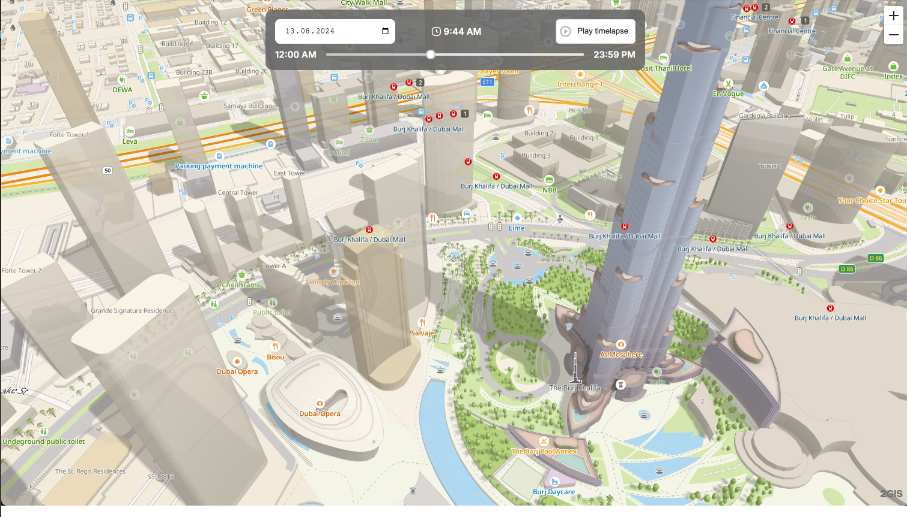

# MapGL Shadows

This monorepo contains lighting utils for [MapGL JS API](https://docs.2gis.com/en/mapgl/overview).

For now, is has only [shadows demo](#demo) app.

## Demo

You can inspect demo by navigating to https://2gis.github.io/lighting-control/. Some specific places:

- [The Burj Khalifa, Dubai](https://2gis.github.io/lighting-control/?lng=55.273020&lat=25.195524);
- [The Red Square, Moscow](https://2gis.github.io/lighting-control/?lng=37.622656&lat=55.752770).

### Specific date and time

Demo app allows you to select specific date (using datepicker) and time (using slider). Map lighting will be updated on every date/time change. Also, time lapse may be enabled.

## Lighting control plugin

TBD
